Drug Consumption Data Analysis
================

``` r
library(tidyverse)
library(viridis)
library(hrbrthemes)
library(RColorBrewer)
library(ggjoy)
library(cowplot)
library(corrplot)
library(rcompanion)
library(corrr)
library(FactoMineR)
library(factoextra)
library(caret)
```

> ## load dataset

``` r
data = read.csv("drug.csv")

head(data, n=3)
```

    ##   X     Age Gender                         Education Country         Ethnicity
    ## 1 0 35 - 44 Female Professional Certificate/ Diploma      UK Mixed-White/Asian
    ## 2 1 25 - 34   Male                  Doctorate Degree      UK             White
    ## 3 2 35 - 44   Male Professional Certificate/ Diploma      UK             White
    ##     Nscore   Escore   Oscore   Ascore   Cscore Impulsive       SS Alcohol
    ## 1  0.31287 -0.57545 -0.58331 -0.91699 -0.00665  -0.21712 -1.18084     CL5
    ## 2 -0.67825  1.93886  1.43533  0.76096 -0.14277  -0.71126 -0.21575     CL5
    ## 3 -0.46725  0.80523 -0.84732 -1.62090 -1.01450  -1.37983  0.40148     CL6
    ##   Amphet Amyl Benzos Caff Cannabis Choc Coke Crack Ecstasy Heroin Ketamine
    ## 1    CL2  CL0    CL2  CL6      CL0  CL5  CL0   CL0     CL0    CL0      CL0
    ## 2    CL2  CL2    CL0  CL6      CL4  CL6  CL3   CL0     CL4    CL0      CL2
    ## 3    CL0  CL0    CL0  CL6      CL3  CL4  CL0   CL0     CL0    CL0      CL0
    ##   Legalh LSD Meth Mushrooms Nicotine Semer VSA
    ## 1    CL0 CL0  CL0       CL0      CL2   CL0 CL0
    ## 2    CL0 CL2  CL3       CL0      CL4   CL0 CL0
    ## 3    CL0 CL0  CL0       CL1      CL0   CL0 CL0

> ## give factor levels to education

``` r
data$Education = factor(data$Education, levels=c("Doctorate Degree", "Masters Degree",
                                "University Degree", "Professional Certificate/ Diploma",
                                "Some College,No Certificate Or Degree", "Left School at 18 years",
                                "Left School at 17 years", "Left School at 16 years",
                                "Left School Before 16 years"), ordered=T)
```

> ## recode usage levels in drugs

``` r
data = data %>%
  mutate(across(c(13:32), ~ recode(.,
                                'CL0'= 0,
                                'CL1'= 1,
                                'CL2'= 2,
                                'CL3'= 3,
                                'CL4'= 4,
                                'CL5'= 5,
                                'CL6'= 6,
                )))
```

    ## Warning: There was 1 warning in `mutate()`.
    ## ℹ In argument: `across(...)`.
    ## Caused by warning in `recode.numeric()`:
    ## ! NAs introduced by coercion

``` r
data <- data %>%
  mutate(Age = case_when(
    Age %in% c("55 - 64", "65+") ~ "55+",
    TRUE ~ Age
  ))
```

``` r
data <- data %>%
  filter(Semer == 0)
  
trainIndex <- createDataPartition(data$Alcohol, p=0.8, times=1, list=F)
data <- data[trainIndex, ]
val <- data[-trainIndex, ]

data <- data %>%
  select(-all_of(c("Semer", "X")))
```

> ## group column names

``` r
drug.cols = colnames(data[, 13:30])
score.cols = colnames(data[, 6:12])
feature.cols = colnames(data[, 1:5])
```

> ## create drug types

``` r
# stimulants <- c("Amphet", "Caff", "Coke", "Crack", "Meth", "Nicotine")
# depressants <- c("Alcohol", "Benzos", "Heroin", "Legalh", "Amyl", "VSA")
# hallucinogens <- c("LSD", "Mushrooms", "Ketamine", "Cannabis", "Ecstasy", "Choc")

stimulants <- c("Amphet", "Coke", "Crack", "Meth", "Nicotine")
depressants <- c("Alcohol", "Benzos", "Heroin", "Legalh", "Amyl", "VSA")
hallucinogens <- c("LSD", "Mushrooms", "Ketamine", "Cannabis", "Ecstasy")
```

> ## create seperate datasets for features and labels

``` r
labels = data[, 13:30]
features = data[, 1:12]
```

> ## check the usage level (addiction) of each drug

``` r
drug.tb = gather(labels, key="drug")

ggplot(drug.tb, aes(x=value)) +
  geom_bar(aes(fill=as.factor(value))) +
  facet_wrap(~drug) +
  scale_fill_brewer(palette="Spectral") +
  theme(legend.position="bottom")
```

<!-- -->

> ## create a dataframe **temp** of indivuals who actively uses dangerous drugs

``` r
drugs = colnames(labels)
dng.drugs = c("Heroin", "Meth", "Crack", "Coke")
recent.usage = c(4, 5, 6)

temp = data %>%
  filter(Heroin %in% recent.usage | Meth %in% recent.usage | Crack %in% recent.usage | Coke %in% recent.usage)
```

> ## plot the distribution in education levels in **temp**

``` r
ggplot(temp, aes(y=Education)) +
  geom_bar(aes(fill=Education)) +
  scale_fill_brewer(palette="RdBu") +
  labs(title="dangerous drug usage in education groups")
```

<!-- -->

> ## plot the distribution in age levels in **temp**

``` r
ggplot(temp, aes(y=Age)) +
  geom_bar(aes(fill=Age)) + 
  scale_fill_ipsum() +
  labs(title="dagerous drugs usage in age groups")
```

<!-- -->

> ## Nscore behaviour in drug groups

``` r
df.score = labels %>%
  bind_cols(data[, score.cols])

df.score.pivot = gather(df.score, key="drug", "usage", drug.cols)
```

    ## Warning: Using an external vector in selections was deprecated in tidyselect 1.1.0.
    ## ℹ Please use `all_of()` or `any_of()` instead.
    ##   # Was:
    ##   data %>% select(drug.cols)
    ## 
    ##   # Now:
    ##   data %>% select(all_of(drug.cols))
    ## 
    ## See <https://tidyselect.r-lib.org/reference/faq-external-vector.html>.
    ## This warning is displayed once every 8 hours.
    ## Call `lifecycle::last_lifecycle_warnings()` to see where this warning was
    ## generated.

``` r
df.score.pivot %>%
  filter(usage >= 4) %>%
  filter(drug %in% dng.drugs) %>%
  ggplot(., aes(x=Nscore)) + 
    geom_histogram(bins=20) +
    facet_wrap(~drug)
```

<!-- -->

> ## score distributions in depressant users

``` r
color = brewer.pal(5, "Spectral")

for (i in stimulants) {
  p = gather(data, key="score", value="value", score.cols) %>%
    filter(!!sym(i) >=4) %>%
    ggplot(., aes(x=value)) +
    geom_histogram(bins=20, aes(y=..density.., fill="count")) +
    geom_density(aes(fill="density", alpha=0.5)) +
    labs(title=i) +
    facet_wrap(~score) +
    scale_fill_brewer(palette="Set1")
  print(p)
}
```

    ## Warning: Using an external vector in selections was deprecated in tidyselect 1.1.0.
    ## ℹ Please use `all_of()` or `any_of()` instead.
    ##   # Was:
    ##   data %>% select(score.cols)
    ## 
    ##   # Now:
    ##   data %>% select(all_of(score.cols))
    ## 
    ## See <https://tidyselect.r-lib.org/reference/faq-external-vector.html>.
    ## This warning is displayed once every 8 hours.
    ## Call `lifecycle::last_lifecycle_warnings()` to see where this warning was
    ## generated.

    ## Warning: The dot-dot notation (`..density..`) was deprecated in ggplot2 3.4.0.
    ## ℹ Please use `after_stat(density)` instead.
    ## This warning is displayed once every 8 hours.
    ## Call `lifecycle::last_lifecycle_warnings()` to see where this warning was
    ## generated.

<!-- --><!-- --><!-- --><!-- --><!-- -->

> ## Analysis on Cannabis
>
> #### age group distribution in each usage group

``` r
i = c("Cannabis")
data %>%
  group_by(!!sym(i), Age) %>%
  tally() %>%
  ggplot(., aes(y=Age, x=n, fill=Age)) +
  geom_bar(stat="identity") +
  scale_fill_ft() +
  facet_wrap(vars(!!sym(i)))
```

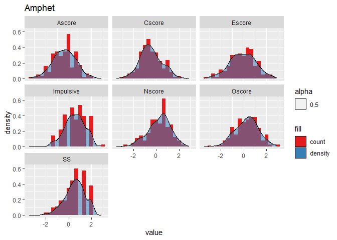<!-- -->

> ## popular Ages groups in each drug

``` r
plt1 = data %>%
  gather(., key="drug", value="usage", drug.cols) %>%
  filter(usage >= 4) %>%
  mutate(drug = fct_reorder(.f = drug,
                            .x = Age,
                            .fun = function(.x) mean(.x == "18 - 24"),
                            .desc = T)) %>%
  ggplot(., aes(y=drug, fill=Age)) +
  geom_bar(position="fill") +
  scale_fill_brewer(palette="Accent") +
  theme(legend.position="bottom")

age.popular.drugs = data %>%
  gather(., key="drug", value="usage", drug.cols) %>%
  filter(usage >= 4) %>%
  group_by(Age, drug) %>%
  tally() %>%
  group_by(Age) %>%
  slice_max(order_by=n, n=7) %>%
  ungroup() %>%
  distinct(drug)

plt2 = data %>%
  gather(., key="drug", value="usage", drug.cols) %>%
  filter(usage >= 4) %>%
  mutate(drug = if_else(drug %in% c(age.popular.drugs)$drug, drug, "other")) %>%
  ggplot(., aes(y=Age, fill=drug)) +
  geom_bar(position="fill") +
  scale_fill_brewer(palette="Paired") +
  theme(legend.position="bottom")

plot_grid(plt1, plt2, ncol=2, rel_heights=c(2, 1))
```

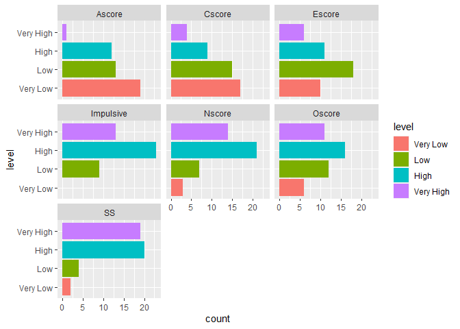<!-- -->

``` r
print(plt1)
```

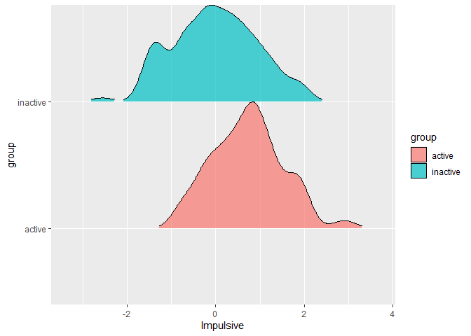<!-- -->

``` r
print(plt2)
```

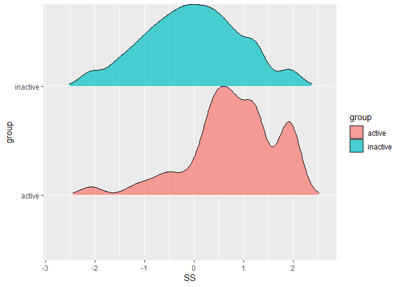<!-- --> \> \##
popular drugs in education levels

``` r
education.popular.drugs = data %>%
  gather(key="drug", value="usage", drug.cols) %>%
  filter(usage >= 4) %>%
  group_by(Education, drug) %>%
  tally() %>%
  slice_max(order_by=n, n=6) %>%
  ungroup() %>%
  distinct(drug) %>%
  pull()

data %>%
  gather(key="drug", value="usage", drug.cols) %>%
  filter(usage >= 4) %>%
  mutate(drug = if_else(drug %in% education.popular.drugs, drug, "other")) %>%
  ggplot(aes(y=Education, fill=drug)) +
  geom_bar(position="fill") +
  scale_fill_brewer(palette="Paired")
```

<!-- -->

> ## popular drugs in Countries

``` r
country.popular.drugs = data %>%
  gather(key="drug", value="usage", drug.cols) %>%
  filter(usage >= 4) %>%
  group_by(Country, drug) %>%
  tally() %>%
  slice_max(order_by=n, n=7) %>%
  ungroup() %>%
  distinct(drug) %>%
  pull()

data %>%
  gather(key="drug", value="usage", drug.cols) %>%
  filter(usage >= 4) %>%
  mutate(drug = if_else(drug %in% country.popular.drugs, drug, "other")) %>%
  ggplot(aes(y=Country, fill=drug)) +
  geom_bar(position="fill") +
  scale_fill_brewer(palette="Paired")
```

    ## Warning in RColorBrewer::brewer.pal(n, pal): n too large, allowed maximum for palette Paired is 12
    ## Returning the palette you asked for with that many colors

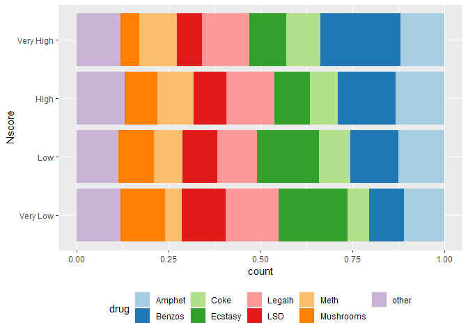<!-- -->

> ## legal constraint in countries

``` r
# Group 1: Low Perceived Risk
low_perceived_risk <- c("Alcohol", "Caff", "Choc")

# Group 2: Moderate Perceived Risk
moderate_perceived_risk <- c("Nicotine", "Benzos", "Amphet", "Ketamine", "Meth", "Cannabis")

# Group 3: High Perceived Risk
high_perceived_risk <- c("Coke", "Crack", "Ecstasy", "Heroin", "LSD", "Mushrooms", "Amyl", "Legalh", "Semer", "VSA")

data %>%
  gather(key="drug", value="usage", drug.cols) %>%
  filter(usage >= 4) %>%
  mutate(drug.risk = case_when(drug %in% low_perceived_risk ~ "low",
                               drug %in% moderate_perceived_risk ~ "moderate",
                               drug %in% high_perceived_risk ~ "high",
                               T ~ "unknown")) %>%
  mutate(drug.risk = factor(drug.risk, levels=c("low", "moderate", "high"))) %>%
  mutate(Country = fct_reorder(.f = Country,
                               .x = drug.risk,
                               .fun = function(.x) mean(.x == "high"),
                               .desc = T)) %>%
  ggplot(aes(y=Country, fill=drug.risk)) +
  geom_bar(position="fill") +
  scale_fill_brewer(direction = 1)
```

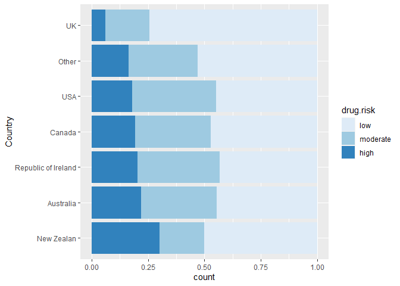<!-- -->

> ## popular drugs within genders

``` r
lvls <- data %>%
  gather(key="drug", value="usage", drug.cols) %>%
  filter(usage >= 4) %>%
  count(drug, Gender) %>%
  group_by(drug) %>%
  mutate(prop = prop.table(n)) %>%
  filter(Gender == "Female") %>%
  arrange(prop) %>%
  pull(drug) %>%
  as.character()

data %>%
  gather(key="drug", value="usage", drug.cols) %>%
  filter(usage >= 4) %>%
  mutate(drug = factor(drug, levels=lvls)) %>%
  ggplot(aes(y=drug, fill=Gender)) +
  geom_bar(position="fill")
```

<!-- -->

``` r
data %>%
  gather(key="drug", value="usage", drug.cols) %>%
  filter(usage >= 4) %>%
  mutate(drug=fct_reorder(.f = drug, 
                          .x = Gender,
                          .fun = function(.x) mean(.x == "Female"),
                          .desc = TRUE)) %>%
  ggplot(aes(y=drug, fill=Gender)) +
  geom_bar(position="fill") +
  scale_fill_brewer(palette="Pastel1")
```

<!-- -->

> ## corealtion among drugs

``` r
data %>%
  gather(key="drug", value="usage", drug.cols) %>%
  filter(usage >= 4) %>%
  spread(key="drug", value="usage") %>%
  mutate(across(drug.cols, ~replace_na(., 0))) %>%
  select(all_of(drug.cols)) %>%
  cor(., use = "complete.obs") %>%
  corrplot(., method = "square", type = "lower", order = 'FPC', tl.col = "black", tl.srt = 45, diag = F)
```

<!-- -->

``` r
data %>%
  select(all_of(drug.cols)) %>%
  cor(., use = "complete.obs") %>%
  corrplot(., method = "square", type = "lower", order = 'FPC', tl.col = "black", tl.srt = 45, diag = F)
```

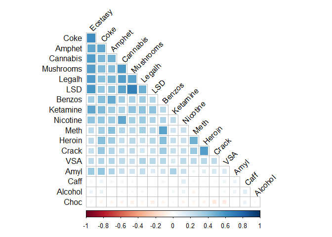<!-- -->

``` r
v1 <- data %>%
  gather(key="drug", value="usage", drug.cols) %>%
  mutate(usage = if_else(usage <= 4, "No", "Yes")) %>%
  mutate(usage = factor(usage)) %>%
  spread(key="drug", value="usage") %>%
  select(all_of(drug.cols)) %>%
  colpair_map(., cramerV)

v1[, -1][is.na(v1[, -1])] = 1
mat = as.matrix(v1[, -1])
colnames(mat) = colnames(v1[, -1])
rownames(mat) = colnames(v1[, -1])

corrplot(mat, method = "square", type = "lower", order = 'FPC', tl.col = "black", tl.srt = 45, diag = F)
```

<!-- -->

> ## density in usgae groups in each drug for each score

    ## Warning: Groups with fewer than two data points have been dropped.

    ## Warning in max(ids, na.rm = TRUE): no non-missing arguments to max; returning
    ## -Inf

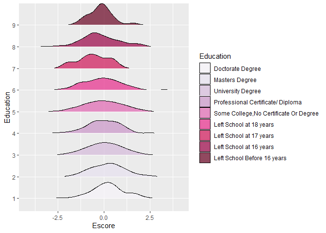

    ## Warning: Groups with fewer than two data points have been dropped.
    ## no non-missing arguments to max; returning -Inf


    ## Warning: Groups with fewer than two data points have been dropped.
    ## no non-missing arguments to max; returning -Inf

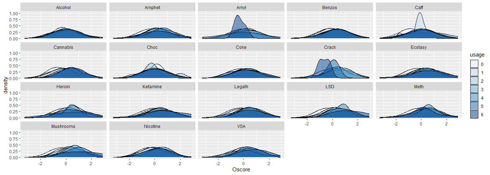

    ## Warning: Groups with fewer than two data points have been dropped.
    ## no non-missing arguments to max; returning -Inf


    ## Warning: Groups with fewer than two data points have been dropped.
    ## no non-missing arguments to max; returning -Inf


    ## Warning: Groups with fewer than two data points have been dropped.
    ## no non-missing arguments to max; returning -Inf


    ## Warning: Groups with fewer than two data points have been dropped.
    ## no non-missing arguments to max; returning -Inf

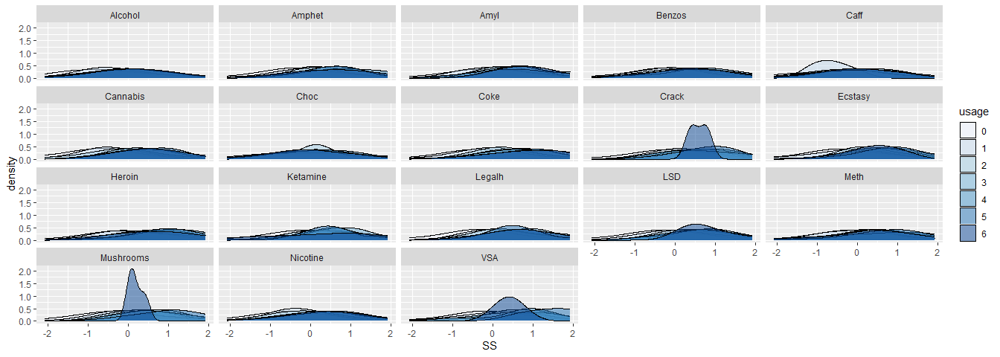

> ## boxplot distribution in usage groups in each drug for each score

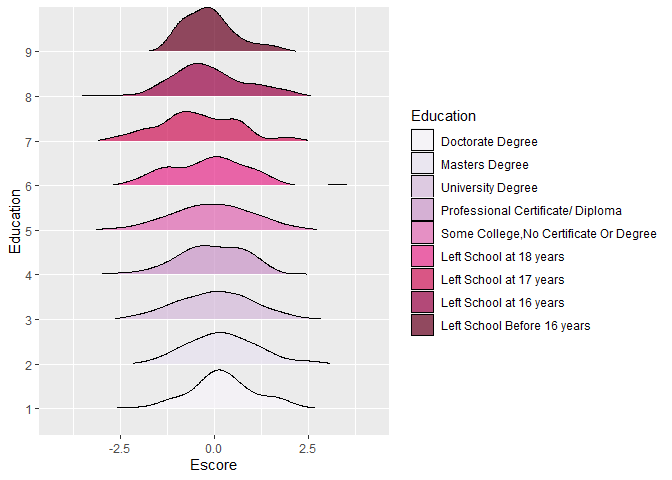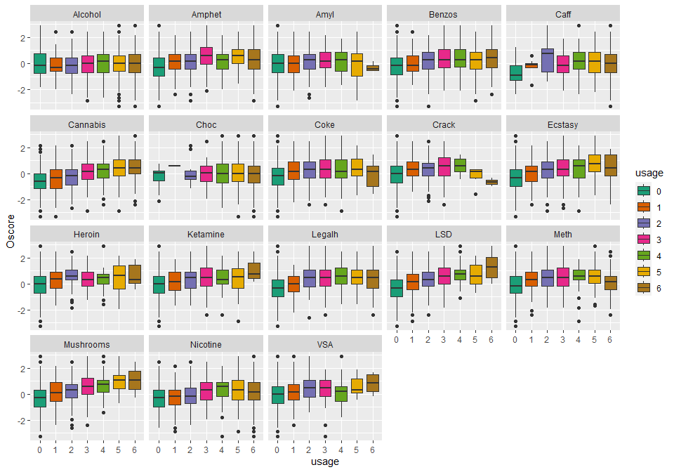

> ## score changes with usage increase for predifined drug groups

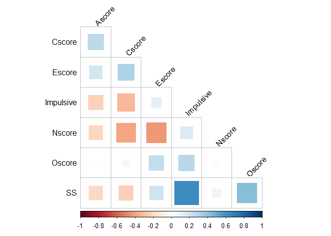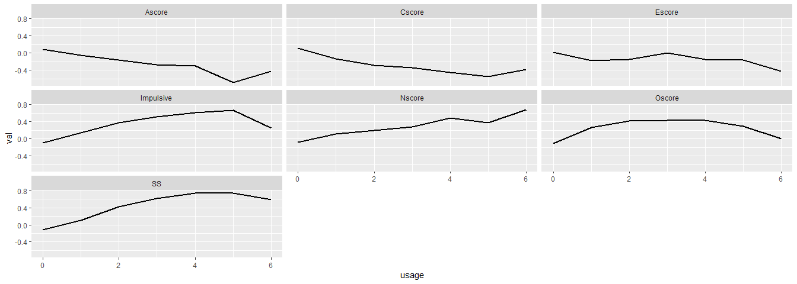

> score changes with age

``` r
for (i in score.cols) {
  plt <- data %>%
    ggplot(., aes(y=!!sym(i), x=Age, fill=Age)) +
    geom_boxplot() +
    scale_fill_brewer(palette="Dark2")
  print(plt)
}
```

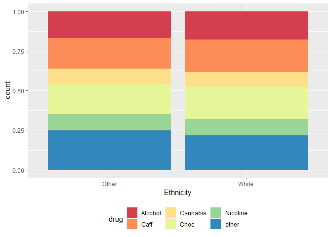<!-- --><!-- --><!-- --><!-- --><!-- --><!-- --><!-- -->

``` r
for (i in score.cols) {
  plt <- ggplot(data, aes(y=Education, x=!!sym(i), fill=Education)) +
    geom_boxplot()
  print(plt)
}
```

<!-- --><!-- --><!-- -->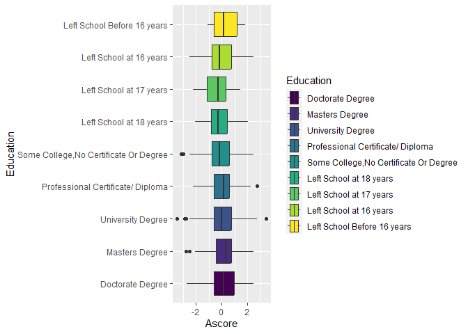<!-- --><!-- --><!-- --><!-- -->

``` r
data %>%
  mutate_at(vars(score.cols), ~(. - mean(.))/ sd(.)) %>%
  gather(key="score", value="val", score.cols) %>%
  filter(Crack >= 4) %>%
  ggplot(., aes(x=val)) +
  geom_histogram() +
  facet_wrap(~score)
```

    ## `stat_bin()` using `bins = 30`. Pick better value with `binwidth`.

<!-- -->

``` r
data %>%
  mutate_at(vars(score.cols), ~ cut(.,
                                    breaks=c(-Inf, -1, 0, 1, Inf),
                                    labels=c("Very Low", "Low", "High", "Very High"),
                                    )
  ) %>%
  gather(key="score", value="level", score.cols) %>%
  mutate(level = factor(level, levels=c("Very Low", "Low", "High", "Very High"))) %>%
  filter(Heroin >= 4) %>%
  ggplot(., aes(y=level)) +
  geom_bar() +
  facet_wrap(~score)
```

<!-- -->

> ## MCA

``` r
dane <- data %>%
  mutate_at(vars(score.cols), ~ cut(.,
                                    breaks=c(-Inf, -1, 0, 1, Inf),
                                    labels=c("Very Low", "Low", "High", "Very High"),
                                    ordered=T)
  ) %>%
  select(-all_of(drug.cols))
```

``` r
res.mca <- MCA(dane)
```

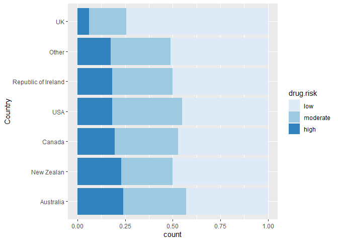<!-- -->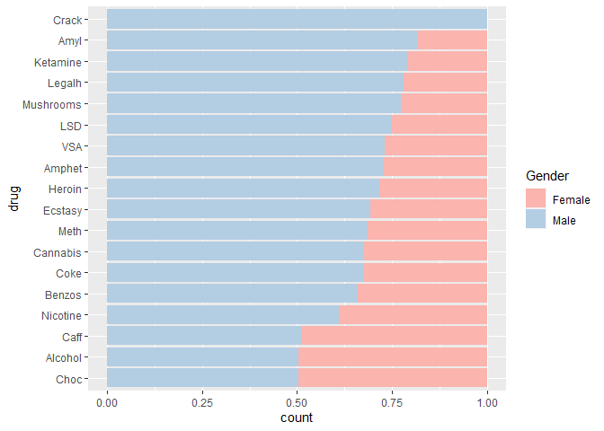<!-- --><!-- -->

``` r
res.km = kmeans(res.mca$ind$coord, centers=2, nstart=25, iter.max=50)
fviz_mfa_ind(res.mca, habillage=as.factor(res.km$cluster), palette=c("darkred", "indianred2"), addEllipses=T, repel=T, geom="point")
```

<!-- -->

``` r
fviz_nbclust(res.mca$ind$coord, kmeans, method = "silhouette")
```

<!-- -->

``` r
fviz_mca_biplot(res.mca, 
               repel = TRUE, # Avoid text overlapping (slow if many point)
               ggtheme = theme_minimal(), label = FALSE)
```

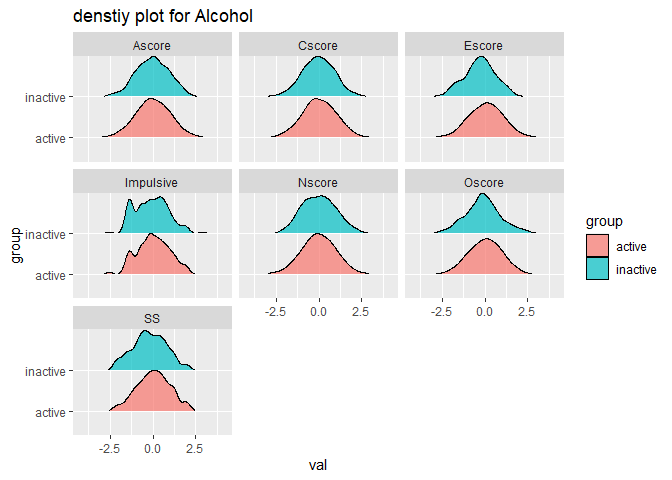<!-- -->

``` r
fviz_mca_var(res.mca, choice = "mca.cor", 
            repel = TRUE, # Avoid text overlapping (slow)
            ggtheme = theme_minimal())
```

<!-- -->

``` r
fviz_mca_var(res.mca, col.var = "cos2",
             gradient.cols = c("#00AFBB", "#E7B800", "#FC4E07"), 
             repel = TRUE, # Avoid text overlapping
             ggtheme = theme_minimal(),
             select.var = list(cos2 = 0.15))
```

<!-- -->

``` r
# Contributions of rows to dimension 1
fviz_contrib(res.mca, choice = "var", axes = 1, top = 15)
```

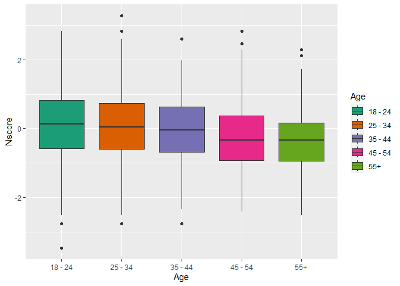<!-- -->

``` r
# Contributions of rows to dimension 2
fviz_contrib(res.mca, choice = "var", axes = 2, top = 15)
```

<!-- -->

``` r
fviz_contrib(res.mca, choice = "var", axes = 1:2, top = 15)
```

<!-- -->

``` r
fviz_mca_ind(res.mca, col.ind = "cos2", 
             gradient.cols = c("#00AFBB", "#E7B800", "#FC4E07"),
             ggtheme = theme_minimal(),
             labels=F)
```

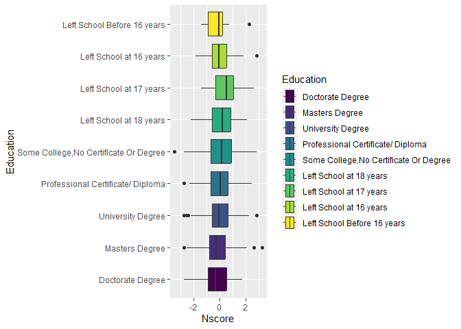<!-- -->

``` r
for (i in colnames(dane)) {
  plt <- dane %>%
    mutate(cluster = res.km$cluster) %>%
    ggplot(aes(x=cluster, fill=!!sym(i))) +
    geom_bar(position="fill")
  print(plt)
}
```

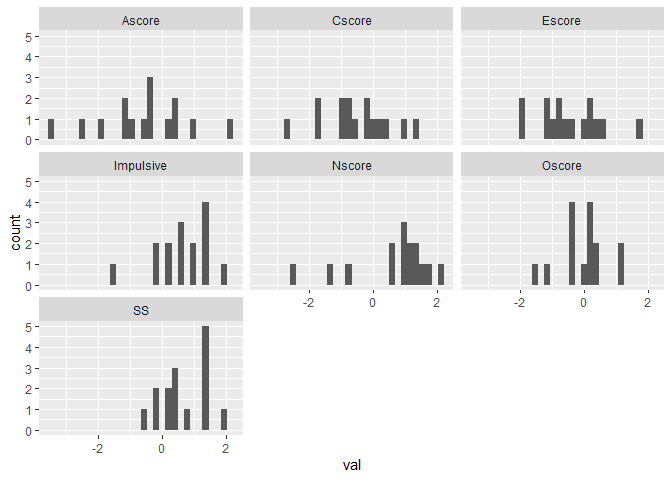<!-- --><!-- --><!-- --><!-- --><!-- --><!-- --><!-- --><!-- --><!-- --><!-- --><!-- --><!-- -->

> ## FAMD

``` r
cols = c("Country", "Ethnicity")

for (col in cols) {
  features[[col]] = recode_factor(features[[col]], "Other" = paste0(col, "other"))
}

res.famd = FAMD(features)
```

    ## Warning: ggrepel: 1476 unlabeled data points (too many overlaps). Consider
    ## increasing max.overlaps

    ## Warning: ggrepel: 23 unlabeled data points (too many overlaps). Consider
    ## increasing max.overlaps

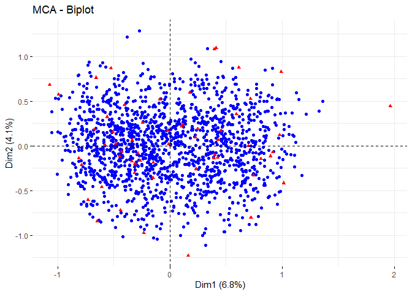<!-- -->

    ## Warning: ggrepel: 1476 unlabeled data points (too many overlaps). Consider
    ## increasing max.overlaps

<!-- --><!-- -->

    ## Warning: ggrepel: 2 unlabeled data points (too many overlaps). Consider
    ## increasing max.overlaps

<!-- --><!-- -->

``` r
fviz_famd_var(res.famd, "quanti.var", repel=T, col.var="contrib")
```

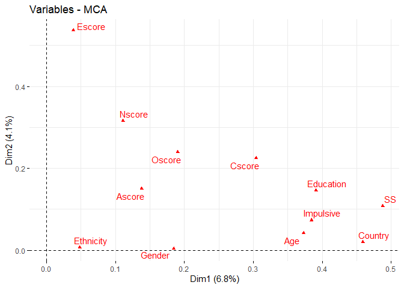<!-- -->

``` r
fviz_famd_var(res.famd, "quali.var", repel=T, col.var="contrib")
```

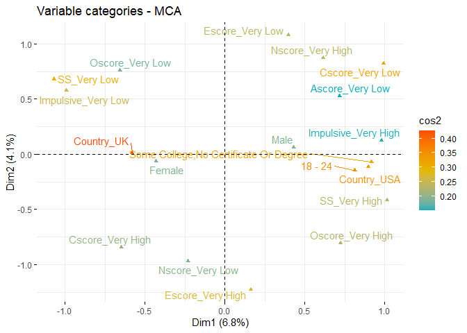<!-- -->

``` r
fviz_famd_var(res.famd, "var", repel=T, col.var="coord")
```

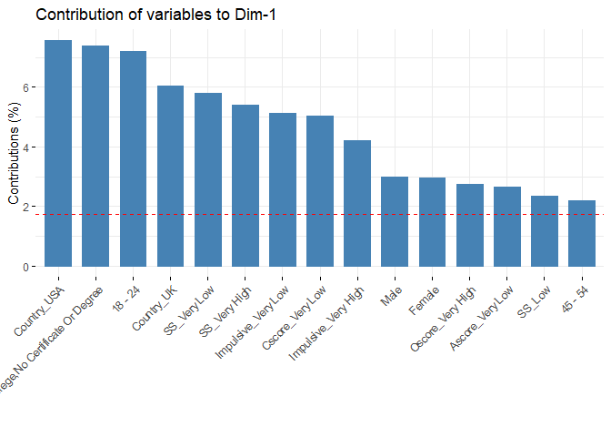<!-- -->

``` r
fviz_screeplot(res.famd)
```

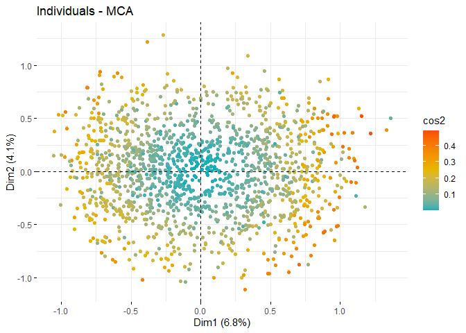<!-- -->

``` r
as.data.frame(res.famd$eig)
```

    ##        eigenvalue percentage of variance cumulative percentage of variance
    ## comp 1   3.145196               9.828737                          9.828737
    ## comp 2   1.908121               5.962877                         15.791614
    ## comp 3   1.385673               4.330229                         20.121843
    ## comp 4   1.270308               3.969712                         24.091555
    ## comp 5   1.217519               3.804746                         27.896301

``` r
fviz_mfa_ind(res.famd, geom="point")
```

<!-- -->

``` r
res.km = kmeans(res.famd$ind$coord, centers=2, nstart=25, iter.max=50)
fviz_mfa_ind(res.famd, habillage=as.factor(res.km$cluster), palette=c("darkred", "indianred2"), addEllipses=T, repel=T, geom="point")
```

<!-- -->

``` r
fviz_nbclust(res.famd$ind$coord, kmeans, method = "silhouette")
```

<!-- -->

``` r
for (i in feature.cols) {
  plt <- features %>%
    mutate(cluster = res.km$cluster) %>%
    ggplot(aes(x=cluster, fill=!!sym(i))) +
    geom_bar(position="fill")
  print(plt)
}
```

<!-- --><!-- --><!-- --><!-- --><!-- -->

``` r
display.brewer.all()
```

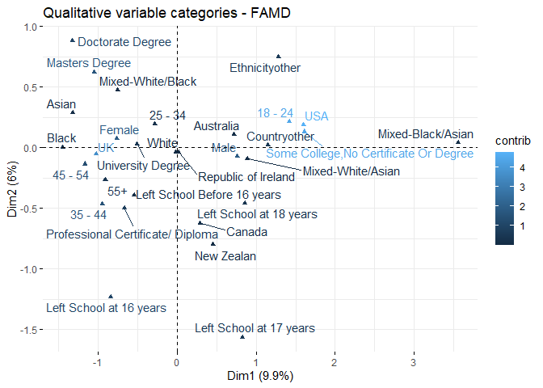<!-- -->

``` r
brewer.pal.info
```

    ##          maxcolors category colorblind
    ## BrBG            11      div       TRUE
    ## PiYG            11      div       TRUE
    ## PRGn            11      div       TRUE
    ## PuOr            11      div       TRUE
    ## RdBu            11      div       TRUE
    ## RdGy            11      div      FALSE
    ## RdYlBu          11      div       TRUE
    ## RdYlGn          11      div      FALSE
    ## Spectral        11      div      FALSE
    ## Accent           8     qual      FALSE
    ## Dark2            8     qual       TRUE
    ## Paired          12     qual       TRUE
    ## Pastel1          9     qual      FALSE
    ## Pastel2          8     qual      FALSE
    ## Set1             9     qual      FALSE
    ## Set2             8     qual       TRUE
    ## Set3            12     qual      FALSE
    ## Blues            9      seq       TRUE
    ## BuGn             9      seq       TRUE
    ## BuPu             9      seq       TRUE
    ## GnBu             9      seq       TRUE
    ## Greens           9      seq       TRUE
    ## Greys            9      seq       TRUE
    ## Oranges          9      seq       TRUE
    ## OrRd             9      seq       TRUE
    ## PuBu             9      seq       TRUE
    ## PuBuGn           9      seq       TRUE
    ## PuRd             9      seq       TRUE
    ## Purples          9      seq       TRUE
    ## RdPu             9      seq       TRUE
    ## Reds             9      seq       TRUE
    ## YlGn             9      seq       TRUE
    ## YlGnBu           9      seq       TRUE
    ## YlOrBr           9      seq       TRUE
    ## YlOrRd           9      seq       TRUE
