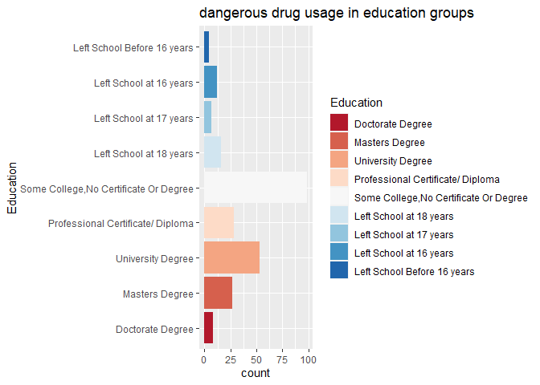
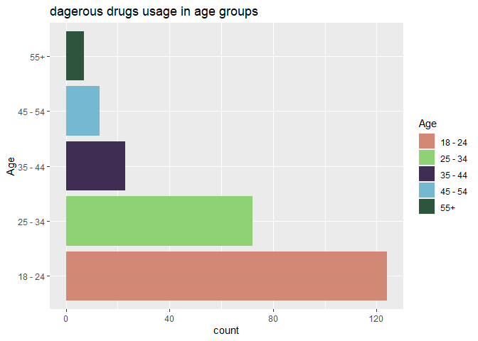
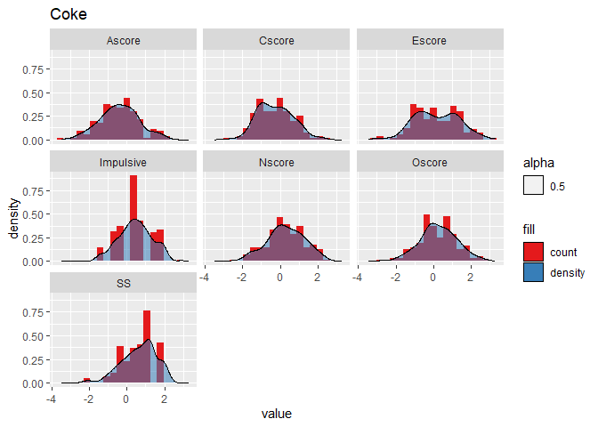
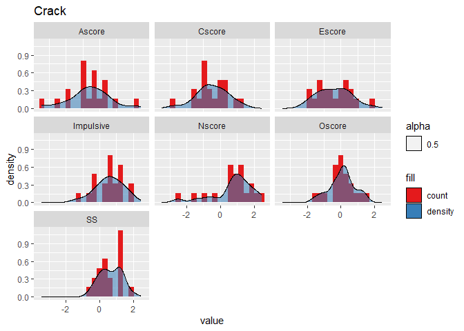
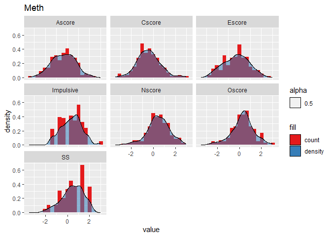
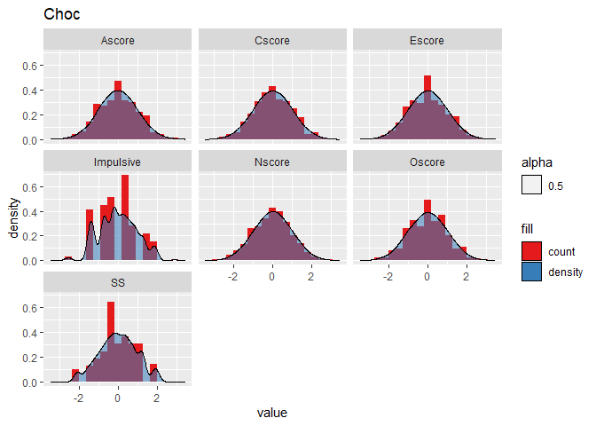

Drug Consumption Data Analysis
================

``` r
library(tidyverse)
library(viridis)
library(hrbrthemes)
library(RColorBrewer)
library(ggjoy)
```

> ## load dataset

``` r
data = read.csv("drug.csv")
head(data, n=3)
```

    ##   X     Age Gender                         Education Country         Ethnicity
    ## 1 0 35 - 44 Female Professional Certificate/ Diploma      UK Mixed-White/Asian
    ## 2 1 25 - 34   Male                  Doctorate Degree      UK             White
    ## 3 2 35 - 44   Male Professional Certificate/ Diploma      UK             White
    ##     Nscore   Escore   Oscore   Ascore   Cscore Impulsive       SS Alcohol
    ## 1  0.31287 -0.57545 -0.58331 -0.91699 -0.00665  -0.21712 -1.18084     CL5
    ## 2 -0.67825  1.93886  1.43533  0.76096 -0.14277  -0.71126 -0.21575     CL5
    ## 3 -0.46725  0.80523 -0.84732 -1.62090 -1.01450  -1.37983  0.40148     CL6
    ##   Amphet Amyl Benzos Caff Cannabis Choc Coke Crack Ecstasy Heroin Ketamine
    ## 1    CL2  CL0    CL2  CL6      CL0  CL5  CL0   CL0     CL0    CL0      CL0
    ## 2    CL2  CL2    CL0  CL6      CL4  CL6  CL3   CL0     CL4    CL0      CL2
    ## 3    CL0  CL0    CL0  CL6      CL3  CL4  CL0   CL0     CL0    CL0      CL0
    ##   Legalh LSD Meth Mushrooms Nicotine Semer VSA
    ## 1    CL0 CL0  CL0       CL0      CL2   CL0 CL0
    ## 2    CL0 CL2  CL3       CL0      CL4   CL0 CL0
    ## 3    CL0 CL0  CL0       CL1      CL0   CL0 CL0

> ## give factor levels to education

``` r
data$Education = factor(data$Education, levels=c("Doctorate Degree", "Masters Degree",
                                "University Degree", "Professional Certificate/ Diploma",
                                "Some College,No Certificate Or Degree", "Left School at 18 years",
                                "Left School at 17 years", "Left School at 16 years",
                                "Left School Before 16 years"))
```

> ## recode usage levels in drugs

``` r
data = data %>%
  mutate(across(c(14:32), ~ recode(., 
                                'CL0'= 0,
                                'CL1'= 1,
                                'CL2'= 2,
                                'CL3'= 3,
                                'CL4'= 4,
                                'CL5'= 5,
                                'CL6'= 6,
                )))
```

> ## group column names

``` r
drug.cols = colnames(data[, 14:32])
score.cols = colnames(data[, 7:13])
feature.cols = colnames(data[, 1:6])
```

> ## create drug types

``` r
stimulants <- c("Amphet", "Caff", "Coke", "Crack", "Meth", "Nicotine")
depressants <- c("Alcohol", "Benzos", "Heroin", "Legalh", "Amyl", "VSA")
hallucinogens <- c("LSD", "Mushrooms", "Ketamine", "Cannabis", "Ecstasy", "Choc")
```

> ## create seperate datasets for features and labels

``` r
labels = data[, 14:32]
features = data[, 1:13]
```

> ## check the usage level (addiction) of each drug

``` r
drug.tb = gather(labels, key="drug")

ggplot(drug.tb, aes(y=value)) +
  geom_bar() +
  facet_wrap(~drug) +
  scale_color_ipsum()
```

<!-- -->

> ## create a dataframe **temp** of indivuals who actively uses dangerous drugs

``` r
drugs = colnames(labels)
dng.drugs = c("Heroin", "Meth", "Crack", "Coke")
recent.usage = c(4, 5, 6)

temp = data %>%
  filter(Heroin %in% recent.usage | Meth %in% recent.usage | Crack %in% recent.usage | Coke %in% recent.usage)
```

> ## plot the distribution in education levels in **temp**

``` r
ggplot(temp, aes(y=Education)) +
  geom_bar(aes(fill=Education)) +
  scale_fill_brewer(palette="RdBu") +
  labs(title="dangerous drug usage in education groups")
```

<!-- -->

> ## plot the distribution in age levels in **temp**

``` r
ggplot(temp, aes(y=Age)) +
  geom_bar(aes(fill=Age)) + 
  scale_fill_ft() +
  labs(title="dagerous drugs usage in age groups")
```

<!-- -->

> ## Nscore behaviour in drug groups

``` r
df.score = labels %>%
  bind_cols(data[, 7:13])

df.score.pivot = gather(df.score, key="drug", "usage", 1:19)

df.score.pivot %>%
  filter(usage >= 4) %>%
  filter(drug %in% dng.drugs) %>%
  ggplot(., aes(x=Nscore)) + 
    geom_histogram(bins=20) +
    facet_wrap(~drug)
```

<!-- -->

> ## score distributions in depressant users

``` r
color = brewer.pal(5, "Spectral")

for (i in hallucinogens) {
  p = gather(data, key="score", value="value", score.cols) %>%
    filter(!!sym(i) >=4) %>%
    ggplot(., aes(x=value)) +
    geom_histogram(bins=20, aes(y=..density.., fill="count")) +
    geom_density(aes(fill="density", alpha=0.5)) +
    labs(title=i) +
    facet_wrap(~score) +
    scale_fill_brewer(palette="Set1")
  print(p)
}
```

    ## Warning: Using an external vector in selections was deprecated in tidyselect 1.1.0.
    ## ℹ Please use `all_of()` or `any_of()` instead.
    ##   # Was:
    ##   data %>% select(score.cols)
    ## 
    ##   # Now:
    ##   data %>% select(all_of(score.cols))
    ## 
    ## See <https://tidyselect.r-lib.org/reference/faq-external-vector.html>.
    ## This warning is displayed once every 8 hours.
    ## Call `lifecycle::last_lifecycle_warnings()` to see where this warning was
    ## generated.

    ## Warning: The dot-dot notation (`..density..`) was deprecated in ggplot2 3.4.0.
    ## ℹ Please use `after_stat(density)` instead.
    ## This warning is displayed once every 8 hours.
    ## Call `lifecycle::last_lifecycle_warnings()` to see where this warning was
    ## generated.

<!-- --><!-- --><!-- --><!-- --><!-- --><!-- -->

``` r
display.brewer.all()
```

<!-- -->
